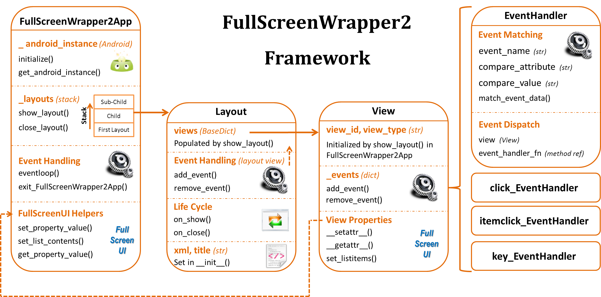

# About

readtext is a sample project for QPython which show how to use QSL4A features.


## Runtime Screenshot


## How to run

Please checkout this project and put it on the /sdcard/qpython/projects.

You need to install Qpython3 with QPYPI before running it.

```
pip3 install androidhelper

```

Then you can run it from QPython's Quick Start.


## Introduction

Author: yohaa0

It's based on the [FullScreenWrapper2: An Python SL4A GUI framework for Android](http://srinathh.github.io/opensource/fullscreenwrapper/)

## FullScreenWapper2
    FullScreenWapper2 is a GUI Framework for developing full screen apps using the FullScreenUI API functions provided by Scripting Layer for Android (SL4A) using Python-for-Android It enables Python SL4A scripts to get a look & feel similar to Android Java apps using the same Views used by native Java apps XML Layouts and provides pythonic access to events.

## 特性

* Managed eventloop & a layout stack enabling easy parent->child->parent transitions
* EventHandler classes with event-matching functions pre-built for standard View events like click,itemclick(ListView) and key
* Device Sensors & other similar SL4A/Custom events can also be caught & managed eventloop + EventHandler class
* Pythonic access to the views and properties of the layout (ie. MainLayout.views.txt_label.background = “#FFAA00AA”)

## Framework Overview



## We need your help
It could be ported to QPython3 easily. You can try to port qsl4ahelper-qpython2 to qpython3 first. That will be great if you are interested in helping this.
